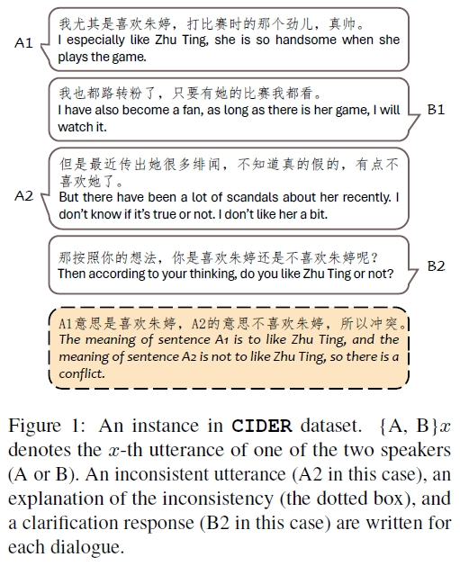

# CIDER
 Resources for paper "[Inconsistent dialogue responses and how to recover from them]()".

## Dataset
The proposed dataset CIDER is located in folder `data/`, where there are two files according to the data source. The English version will come soon.

<div align="center"> 
</div>

## Model Training and Testing
Script `train.py` is for training and `test_datasets.py` for testing. Task to conduct could be chosen by parameter `task`, here is an example for `resolve_turn` task.
### Multi-GPU Training
```shell
num_gpu=4
lr=3e-4
task=resolve_turn
arch=t5
model_sig=uer/t5-base-chinese-cluecorpussmall
python -m torch.distributed.launch --use_env --nnodes=1 --nproc_per_node=${num_gpu} train.py \
    --debug=n \
    --dataset=both \
    --task=${task} \
    --add_tcon=y \
    --add_cdconv=n \
    --add_stance=n \
    --add_ocnli=n \
    --arch=${arch} \
    --save_dir=exp/resolver/${task}_${arch}_${lr} \
    --ckpt_dir='' \
    --model_sig=${model_sig} \
    --learning_rate=${lr} \
    --batch_size=16 \
    --patience_num=3 \
    --validate_on_tcon=y \
    --with_explanation=n
```
### Testing

```shell
task=resolve_turn
arch=t5
lr=3e-4
python test_datasets.py \
    --debug=n \
    --task=${task} \
    --arch=${arch} \
    --save_dir=exp/resolver/${task}_${arch}_${lr} \
    --model_dir=exp/resolver/${task}_${arch}_${lr} \
    --with_explanation=n
```

## Citation
Please cite our paper if you find the codes or dataset helpful using this BibTeX:
```bib
@misc{zhang2024inconsistent,
      title={Inconsistent dialogue responses and how to recover from them}, 
      author={Mian Zhang and Lifeng Jin and Linfeng Song and Haitao Mi and Dong Yu},
      year={2024},
      eprint={2401.10353},
      archivePrefix={arXiv},
      primaryClass={cs.CL}
}
```
